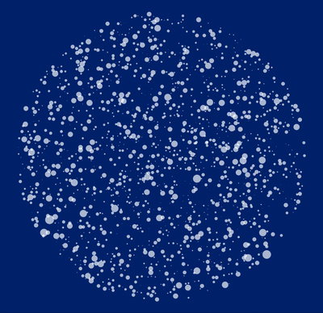

# Point Cloud Art

Create point clouds containing hidden images using machine learning inspired techniques. An example can be found here: [https://haltakov.net/point-cloud-brazil/](https://haltakov.net/point-cloud-brazil/). Use the follwing codes to see the first 3 images. There are 3 more that you can try finidng yourself :)
- 8198399457
- 6674004952
- 0856561979



## How To

To create your own point cloud open the `generate_2d_point_cloud` Jupyter notebook and follow the instructions in it.

Make sure that you also install all required dependencies in your virtual environment:

```
pip install -r requirements.txt
```

## About

This project was created as an experiment by [Vladimir Haltakov](https://twitter.com/haltakov). Follow me on [Twitter](https://twitter.com/haltakov) for more interesting stuff on Machine Learning.
